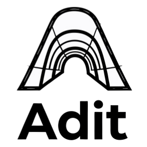

<p align="center">
  
</p>

# Adit

<p align="center">
  <a href="LICENSE"></a>
  <a href="https://github.com/jabin-hao/Adit/releases"></a>
  <a href="https://github.com/jabin-hao/Adit/stargazers"></a>
  <br>
  
  
  
  
  
  
</p>

> *Adit* — a mine entrance, your gateway to remote servers.

A cross-platform SSH/SFTP client built with [Tauri](https://tauri.app) + [React](https://react.dev) + [Rust](https://www.rust-lang.org).

## Features

- 🔐 **SSH/SFTP** — password, key, and SSH agent authentication
- 📁 **File Manager** — browse, upload, download, and edit remote files
- 🖥️ **Terminal** — full SSH terminal emulation via xterm.js
- 📋 **Tabbed UI** — manage multiple servers in one window
- 🎨 **Light/Dark** — Ant Design theme switching
- ⚡ **Lightweight** — ~5MB binary, Rust backend for I/O

## Quick Start

### Prerequisites

- [Rust](https://rustup.rs) >= 1.77
- [Bun](https://bun.sh) >= 1.1
- Platform build dependencies (see [Tauri Prerequisites](https://tauri.app/start/prerequisites/))

### Install & Run

```bash
git clone https://github.com/jabin-hao/Adit.git
cd adit
bun install
bun dev
```

### Build

```bash
bun run build
```

## Tech Stack

| Layer | Technology |
|-------|-----------|
| Desktop | Tauri 2.x |
| Backend | Rust + russh + tokio |
| Frontend | React 19 + TypeScript + Bun |
| UI | Ant Design 5 + Tailwind CSS |
| Terminal | xterm.js |
| State | Zustand |

## Project Structure

```
adit/
├── src/                # React frontend (TypeScript, Ant Design, Zustand)
├── src-tauri/          # Rust backend (russh, tokio, Tauri commands)
├── docs/               # Documentation
└── README.md
```

## Commands

| Command | Description |
|---------|-------------|
| `bun dev` | Start dev mode |
| `bun run build` | Production build |
| `bun run lint` | ESLint check |
| `bun run check` | TypeScript check |
| `bun test` | Run frontend tests |
| `cargo test` | Run Rust tests |

## Documentation

- [中文文档](./docs/README.zh-CN.md)

## Contributing

Issues and PRs are welcome!

```bash
bun run lint
bun run check
```

Please ensure:
- Code passes lint and type checks
- New features include tests
- Commit messages follow [Conventional Commits](https://www.conventionalcommits.org)

## License

[MIT](LICENSE) © 2026 Jabin Hao

---

## Links

- [Tauri Docs](https://tauri.app/docs)
- [russh Docs](https://docs.rs/russh)
- [xterm.js Docs](https://xtermjs.org)
